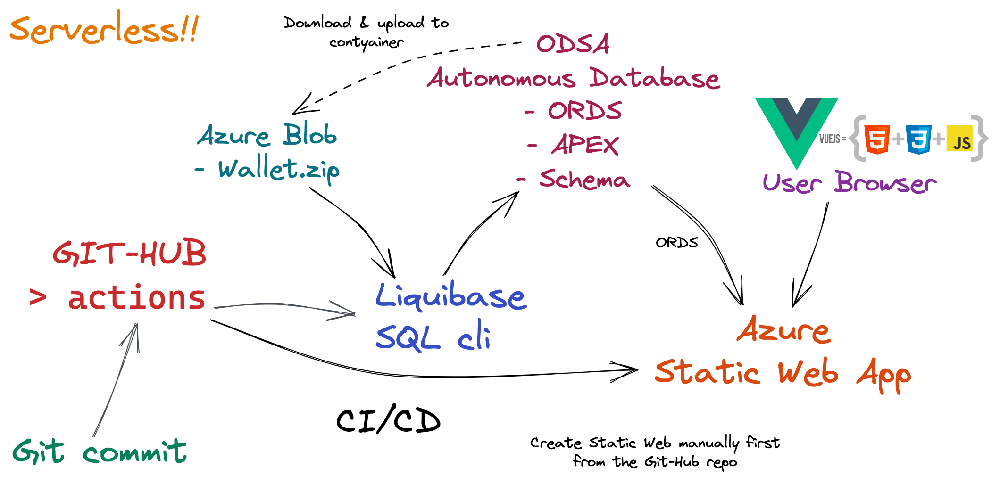

## Instructions

### Deploying single page app to Azure Static Web using Oracle Databases for Azure (ODSA) and GitHub actions

### Steps to complete
    
<ul>
<li>Create Azure ODSA Autonomous Database, with following options:
<ul>
    <li>Select <code>BYOL</code> or <code>License included</code> as billing model depending on your case</li>
    <li>Use suitable Azure cloud <code>region</code> e.g. UK-South</li>
    <li>Define database admin password e.g. <b>RockenRoll123#!</b> This will be used also later as a GitHub Actions secret</li>
</ul>
<li>Create Azure Blob private container for the database wallet</li>
<li>Download <code>Wallet.zip</code> from ODSA and upload it to the Blob container</li>
<li>Create SAS for the Wallet.zip</li>
<li>Fork this repo to your GitHub</li>
<li>Create the following GitBub Actions <code>Secrets</code> to the repo</li>
<ul>
    <li><code>DBNAME</code> Database name e.g. <b>pricing</b></li>
    <li><code>REGION</code> Corresponding OCI region e.g. <b>uk-london-1</b> that you used for Azure earlier</li>
    <li><code>PASSWORD</code> Database admin password that you used earlier e.g. <b>RockenRoll123#!</b></li>
</ul>
<li>Create Azure Static Web VueJS app from GitHub</li>
</ul>

GitHub Azure actions will automatically build and deploy (CI/CD) the Azure Static Web app from gitHub source.
Part of the CI/CD is the Liquibase that will create ODSA <code>PRICEADMIN</code>Schema, add data to it, 
then create ORDS REST services and finally create the APEX sample app for administration.

Access <i>Azure Static Web</i> from your browser.

Access APEX "price admin" application from the <i>Admin</i> -link on the page.
APEX <b>user</b> is <code>priceadmin</code> and <b>password</b> is the one created earlier as sercret i.e. <code>RockenRoll123#!</code>
Edit prices and options and then save and reload the Static Web app html page.

You can test the CI/CD making changes to the Azure Static Web app by making a change to the 
<code>html/index.html</code> source in the repo and then committing and pushing that chance.
GitHub Azure Actions should then automatically build and deploy a new version of the app. 

### See on Youtube
