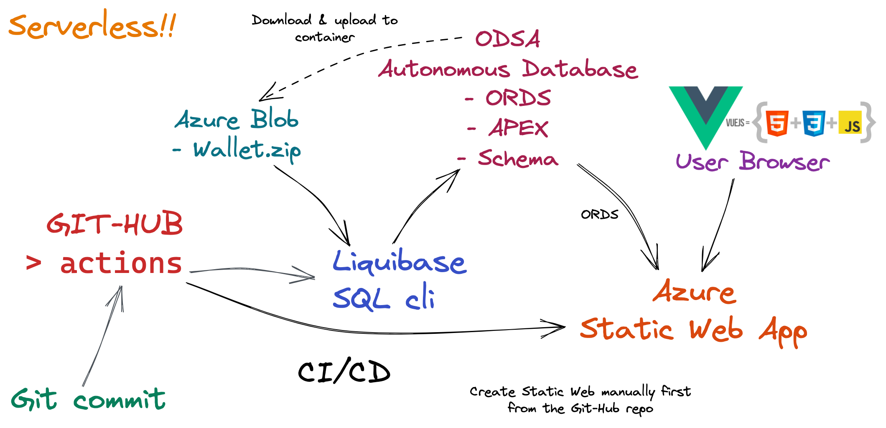

## Instructions

### Deploying single page app to Azure Static Web using Oracle Database Service for Azure (ODSA) and GitHub actions

### Steps to complete
    
<ul>
<li>Create Azure ODSA Autonomous Database with following options:
<ul>
    <li>Select <code>BYOL</code> or <code>License included</code> as billing model depending on your case</li>
    <li>Use suitable Azure cloud <code>region</code> e.g. UK-South</li>
    <li>Define database admin <code>password</code> e.g. <b>RockenRoll123#!</b> This will be used also later as a GitHub Actions <code>Secret</code></li>
</ul>
<li>Create Azure Blob private container for the database wallet</li>
<li>Download <code>Wallet.zip</code> from ODSA and upload it to the Blob container</li>
<li>Create <code>SAS</code> for the Wallet.zip in the private container</li>
<li>Fork or copy the contents of this repo to your GitHub. Make sure <code>.gihub</code> directory is <b>not copied</b> to repo since it will be created by Azure Static Web during it's creation.</li>
<li>Create the following GitBub Actions <code>Secrets</code> to the repo</li>
<ul>
    <li><code>DBNAME</code> Database name e.g. <b>pricing</b></li>
    <li><code>REGION</code> Corresponding OCI region e.g. <b>uk-london-1</b> that you used for Azure earlier. This is just used to create the APEX "price admin" app link on the Azure Static Web app page.</li>
    <li><code>PASSWORD</code> Database admin password that you used earlier e.g. <b>RockenRoll123#!</b></li>
    <li><code>SAS</code> Wallet.zip Azure Blob access that you created earlier in parenthesis e.g. <pre>"https://pricing.blob.core.windows.net/wallet-private/Wallet.zip?sp=r&st=2022-11-26T08:23:00Z&se=2023-11-26T16:23:00Z&spr=https&sv=2021-06-08&sr=b&sig=W4kL6mb.........R7jcUc%3D"</pre></li>
</ul>
<li>Create Azure Static Web app of type <code>VueJS</code> from your GitHub repo and specify <code>app location: /html</code> in the <code>Build details</code></li>
<li>Add the contents of the <code>github-workflow-run</code> file to the <code>.github/workflows .yaml</code> under line #21 
<a href="https://github.com/mikarinneoracle/odsa/blob/main/.github/workflows/azure-static-web-apps-ambitious-beach-02aca8c03.yml#L22" target="_NEW">as it is here</a></li>
</ul>

After committing and pushing the <code>workflow yaml</code> change (use <code>-f</code> option for the <code>git add</code>) GitHub Azure actions will automatically build and deploy (CI/CD) the Azure Static Web app from gitHub source.
Part of the CI/CD is the Liquibase that will create ODSA <code>PRICEADMIN</code>Schema, add data to it, 
then create ORDS REST services and finally create the APEX sample app for administration.

Access <i>Azure Static Web</i> from your browser.

Access APEX "price admin" application from the <i>Admin</i> -link on the page.
APEX <b>user</b> is <code>priceadmin</code> and <b>password</b> is the one created earlier as sercret i.e. <code>RockenRoll123#!</code>
Edit prices and options and then save and reload the Static Web app html page.

Special thanks to my colleague @Christophe Pruvost for his <a href="https://github.com/cpruvost/setup-sqlcl">SQLCli action</a>

### See on Youtube

<a href="https://www.youtube.com/watch?v=w7b_Jx7CvT4" target="YT">https://www.youtube.com/watch?v=w7b_Jx7CvT4</a>
